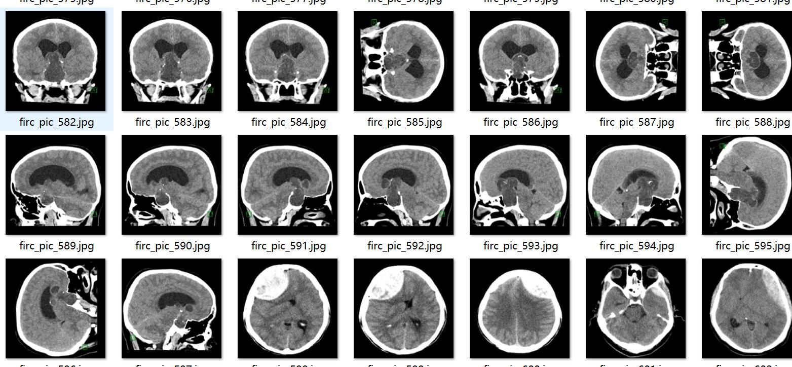
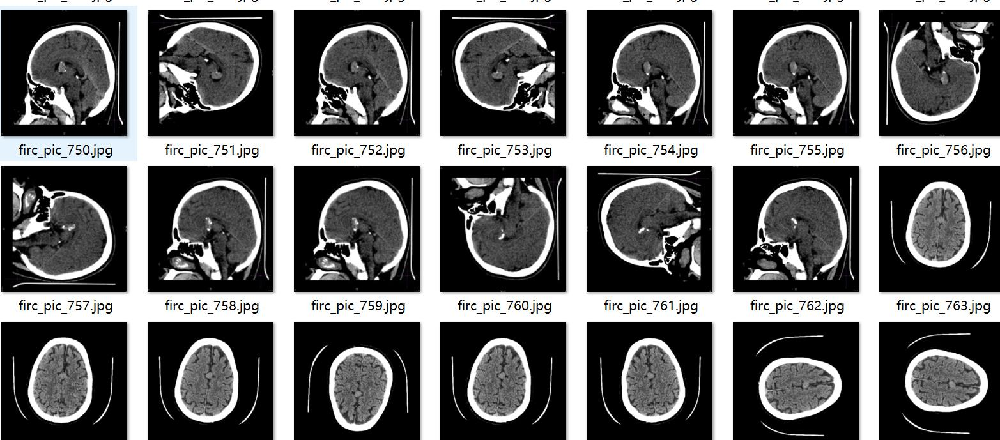
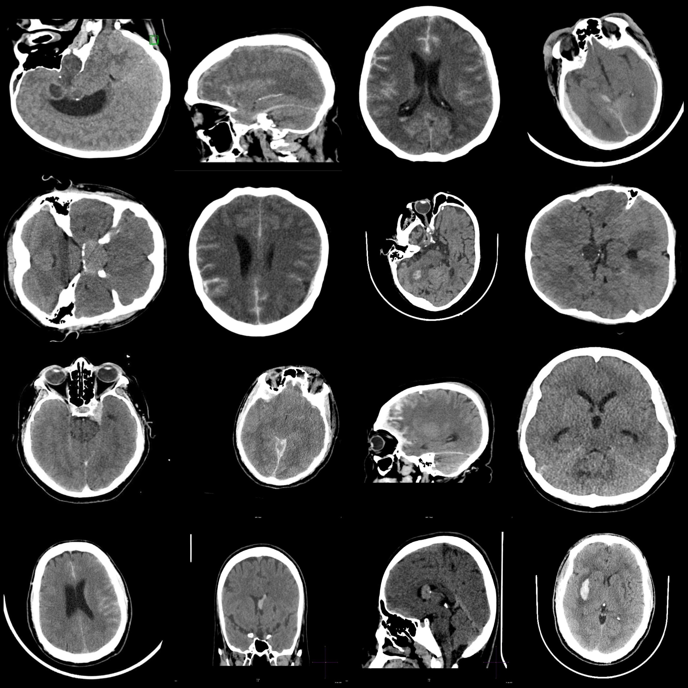
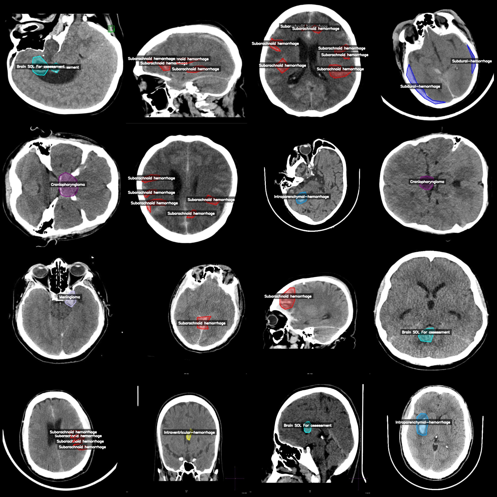
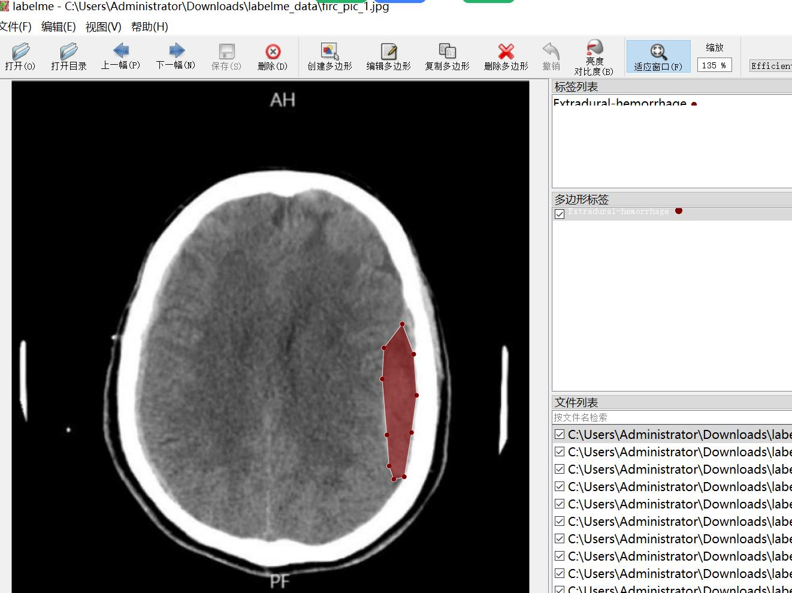

# Intelligent Medical Imaging Brain Diseases Intracerebral Hemorrhage Identification and Segmentation Dataset - LabelMe Format - 1878 Images in 8 Classes

Dataset format: labelme format (without mask files, only including jpg images and corresponding json files)  
Number of images (number of jpeg files): 1878  
Number of labels (number of json files): 1878  
Number of label categories: 8  
Label category names: ["Brain SOL For assessment", "Craniopharyngioma", "Extradural-hemorrhage", "Intraparenchymal-hemorrhage", "Intraventricular-hemorrhage", "Meningioma", "Subarachnoid hemorrhage", "Subdural-hemorrhage"]  
Number of boxes per category:  
Brain SOL For assessment (brain sol for assessment) count = 396  
Craniopharyngioma (craniopharyngioma) count = 201  
Extradural-hemorrhage (extradural-hemorrhage) count = 254  
Intraparenchymal-hemorrhage (intraparenchymal-hemorrhage) count = 325  
Intraventricular-hemorrhage (intracranial-hemorrhage) count = 369  
Meningioma (meningioma) count = 265  
Subarachnoid hemorrhage (subarachnoid hemorrhage) count = 821  
Subdural-hemorrhage (subdural-hemorrhage) count = 251  
Total box count: 2882
Use the labelme tool: annotation=5.5.0
image resolution: 640x640  
Annotation Rules: Drawing polygons around the class for annotation.
Important Notes: You can use LabelMe to open and edit the dataset. The JSON dataset needs to be converted into mask, Yolo format, or COCO format for semantic segmentation or instance segmentation.
Special Statement: This dataset does not guarantee the accuracy of the trained model or weight files.
Image Preview:
Annotation Example:
Randomly selected 16 images from the original image:
Annotation drawing result:
LabelMe editing example:
## Images

Here is a pay link on Stripe ( https://buy.stripe.com/3cs8yP7sY87d0vu9AB ). Please contact me lonlonago@foxmail.com after funding $89, and I will send you a complete data files , thank you!

